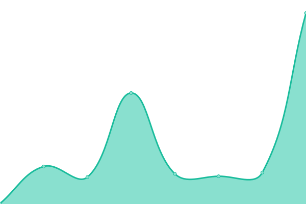
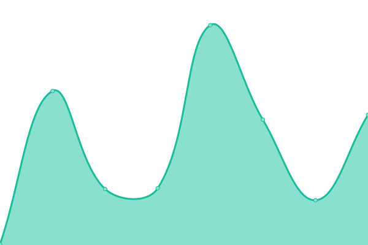

# [📈 Live Status](https://status.svo.lol): <!--live status--> **🟩 All systems operational**

This repository contains the open-source uptime monitor and status page for [Upptime](https://upptime.js.org), powered by [Upptime](https://github.com/upptime/upptime).

With [Upptime](https://upptime.js.org), you can get your own unlimited and free uptime monitor and status page, powered entirely by a GitHub repository. We use [Issues](https://github.com/upptime/upptime/issues) as incident reports, [Actions](https://github.com/lenchq/status/actions) as uptime monitors, and [Pages](https://status.svo.lol) for the status page.

<!--start: status pages-->
<!-- This summary is generated by Upptime (https://github.com/upptime/upptime) -->
<!-- Do not edit this manually, your changes will be overwritten -->
<!-- prettier-ignore -->
| URL | Status | History | Response Time | Uptime |
| --- | ------ | ------- | ------------- | ------ |
|  [Main page](https://svo.lol) | 🟩 Up | [main-page.yml](https://github.com/lenchq/status/commits/HEAD/history/main-page.yml) | 

 651ms
     
 | 

<a href="https://status.svo.lol/history/main-page">18.70%</a>
    

|  [Git](https://git.svo.lol) | 🟩 Up | [git.yml](https://github.com/lenchq/status/commits/HEAD/history/git.yml) | 

 669ms
     
 | 

<a href="https://status.svo.lol/history/git">99.49%</a>
    

|  [Wakapi](https://waka.svo.lol) | 🟩 Up | [wakapi.yml](https://github.com/lenchq/status/commits/HEAD/history/wakapi.yml) | 

 607ms
     
 | 

<a href="https://status.svo.lol/history/wakapi">99.49%</a>
    

|  [Gallery](https://gallery.svo.lol) | 🟩 Up | [gallery.yml](https://github.com/lenchq/status/commits/HEAD/history/gallery.yml) | 

 622ms
     
 | 

<a href="https://status.svo.lol/history/gallery">100.00%</a>
    

<!--end: status pages-->

[**Visit our status website →**](https://status.svo.lol)

## 📄 License

- Powered by: [Upptime](https://github.com/upptime/upptime)
- Code: [MIT](./LICENSE) © [Anand Chowdhary](https://anandchowdhary.com), supported by [Pabio](https://pabio.com)
- Data in the `./history` directory: [Open Database License](https://opendatacommons.org/licenses/odbl/1-0/)
